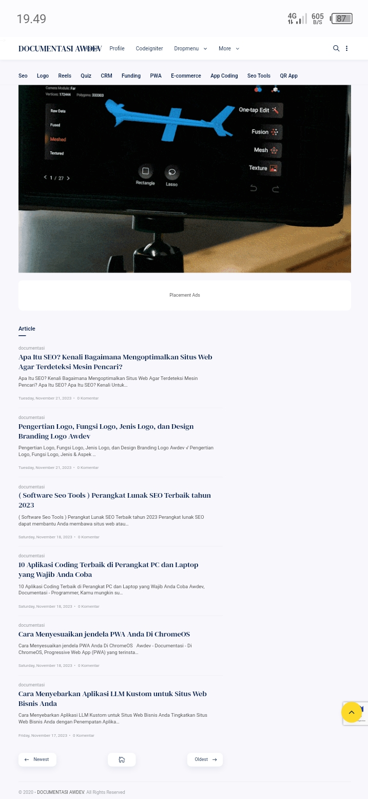

# [android](https://github.com/awdevmyid/android)
Official Program :  @awdevmyid - [awdev](https://www.awdev.my.id)

# WebView
WebView is a view that display web pages inside your application. You can also specify HTML string and can show it inside your application using WebView. WebView makes turns your application to a web application.

In order to add WebView to your application, you have to add <WebView> element to your xml layout file. Its syntax is as follows −

```
<WebView  xmlns:android="http://schemas.android.com/apk/res/android"
   android:id="@+id/webview"
   android:layout_width="fill_parent"
   android:layout_height="fill_parent"
/>

```
In order to use it, you have to get a reference of this view in Java file. To get a reference, create an object of the class WebView. Its syntax is −

```
WebView browser = (WebView) findViewById(R.id.webview);
```

In order to load a web url into the WebView, you need to call a method loadUrl(String url) of the WebView class, specifying the required url. Its syntax is:

```
browser.loadUrl("https://www.awdev.my.id);

```

Apart from just loading url, you can have more control over your WebView by using the methods defined in WebView class. They are listed as follows −


## How to Use WebView in Android?
WebView is a view that displays web pages inside the application. It is used to turn the application into a web application.

```
public class WebView extends AbsoluteLayout implements 
    ViewTreeObserver.OnGlobalFocusChangeListener, 
    ViewGroup.OnHierarchyChangeListener
 ```   
    
Class Hierarchy:

```
java.lang.Object
   ↳  android.view.View
        ↳  android.view.ViewGroup
             ↳  android.widget.AbsoluteLayout
                  ↳  android.webkit.WebView
                  
 ```
 
 
Step by Step Implementation

### Step 1: Create a New Project in Android Studio

To create a new project in Android Studio please refer to How to Create/Start a New Project in Android Studio. The code for that has been given in both Java and Kotlin Programming Language for Android.

### Step 2: Working with the MainActivity File
Go to the MainActivity File and refer to the following code. Below is the code for the MainActivity File. Comments are added inside the code to understand the code in more detail.

#### Java

```
import android.os.Bundle;

import android.webkit.WebView;

import android.webkit.WebViewClient;

import androidx.appcompat.app.AppCompatActivity;
 

public class MainActivity extends AppCompatActivity {
 

    @Override

    protected void onCreate(Bundle savedInstanceState) {

        super.onCreate(savedInstanceState);

        setContentView(R.layout.activity_main);
 

        // Find the WebView by its unique ID

        WebView webView = findViewById(R.id.web);
 

        // loading https://www.geeksforgeeks.org url in the WebView.

        webView.loadUrl("https://blog.awdev.my.id");
 

        // this will enable the javascript.

        webView.getSettings().setJavaScriptEnabled(true);
 

        // WebViewClient allows you to handle 

        // onPageFinished and override Url loading.

        webView.setWebViewClient(new WebViewClient());

    }
}

```

### Step 3: Working with the XML Files
Next, go to the activity_main.xml file, which represents the UI of the project. Below is the code for the activity_main.xml file. Comments are added inside the code to understand the code in more detail.


#### xml

```
<?xml version="1.0" encoding="utf-8"?>

<RelativeLayout xmlns:android="http://schemas.android.com/apk/res/android"

    xmlns:tools="http://schemas.android.com/tools"

    android:layout_width="match_parent"

    android:layout_height="match_parent"

    tools:context="com.gfg.android.examplekotlin.MainActivity">
 

    <!-- unique ID of WebView -->

    <WebView

        android:id="@+id/web"

        android:layout_width="match_parent"

        android:layout_height="match_parent"

        tools:layout_editor_absoluteX="8dp"

        tools:layout_editor_absoluteY="8dp" />

</RelativeLayout>

```


### Step 4: Adding Permissions to the AndroidManifest.xml File
In AndroidManifest.xml, one needs to include the below permission, in order to access the internet

```
<uses-permission android:name="android.permission.INTERNET" />

```

Output:



Original Url : https://blog.awdev.my.id

[android](https://github.com/awdevmyid/android) Public
 Java GNU General Public License v3.0 Updated 4 minutes ago
[awdevmyid.github.io](https://github.com/awdevmyid/awdevmyid.github.io) Public template
 HTML GNU Lesser General Public License v2.1 Updated 12 minutes ago
[aframe](https://github.com/awdevmyid/aframe) Public
 JavaScript MIT License Updated 22 minutes ago
[htmltemplategenerator](https://github.com/awdevmyid/htmltemplategenerator) Public
 JavaScript MIT License Updated last week
[readme](https://github.com/awdevmyid/readme) Public
 TypeScript Mozilla Public License 2.0 Updated last week
[codeIgniter](https://github.com/awdevmyid/codeIgniter) Public
 PHP MIT License Updated last week
[ide](https://github.com/awdevmyid/ide) Public
 JavaScript MIT License Updated last week
[threejs](https://github.com/awdevmyid/threejs) Public template
 JavaScript MIT License Updated last week
[program](https://github.com/awdevmyid/program) Public
 C++ Updated last week
[learn-program](https://github.com/awdevmyid/learn-program) Public template
Simple Blog next js
 HTML GNU General Public License v3.0 Updated 2 weeks ago


DOWNLOAD 
[ANDROID](https://github.com/awdevmyid/android/raw/master/app2843234-n7vy9h.apk)
[MOBILE  APP](https://fastupload.io/en/1DOv8opdX1Vk/gsuDgJC7vaa8pl2/ex5z2X47ymKqk/app2843234-n7vy9h.apk)
[WEB VIEW APP](https://apk.e-droid.net/apk/app2843234-n7vy9h.apk?v=3)
[AWDEV PRO](https://github.com/awdevmyid/android/releases/download/publish/app2843234-n7vy9h.apk)


